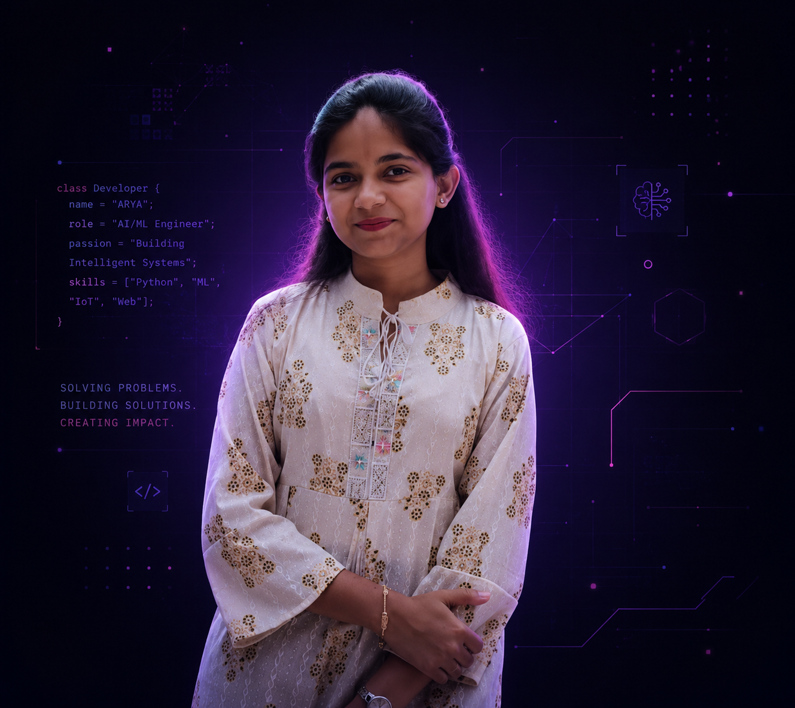

# ⚡ ARYA.OS — Developer & AI/ML Explorer Portfolio

A premium, interactive, and futuristic portfolio built to showcase engineering projects, AI/ML explorations, and software development skills. Designed with an "Operating System" aesthetic, it features deep interactivity, fluid animations, and a built-in AI assistant.



## ✨ Features

- **Futuristic OS Interface:** Dark, neon-accented, glassmorphic design language.
- **Integrated AI Assistant:** A custom-built, interactive AI chat (`ARYA.AI`) that visitors can use to query about skills, projects, and background.
- **Fluid Animations:** Powered by `framer-motion` for smooth page transitions, 3D tilt effects, and responsive interactions.
- **Fully Responsive:** Meticulously optimized layouts across desktop, tablet, and mobile devices.
- **SEO & Social Ready:** Configured with dynamic Open Graph tags, Twitter cards, and JSON-LD structured data for perfect link previews on social platforms.
- **Native SPA Routing:** Custom History API integration enabling deep linking directly to specific sections (e.g., `/projects`, `/about`).
- **Custom 404 System:** An immersive "Sector Not Found" error page.

## 🛠️ Tech Stack

- **Framework:** React 18 + Vite
- **Language:** TypeScript
- **Styling:** Tailwind CSS (with custom configurations for glowing accents and animations)
- **Animation:** Framer Motion
- **Icons:** FontAwesome
- **Deployment Ready:** Configured for Vercel with `vercel.json` rewrite rules.

## 🚀 Getting Started

To run this project locally, follow these steps:

### Prerequisites
Make sure you have [Node.js](https://nodejs.org/) installed on your machine.

### Installation

1. **Clone the repository:**
   ```bash
   git clone https://github.com/Aryasurya12/E_Portfolio.git
   cd E_Portfolio
   ```

2. **Install dependencies:**
   ```bash
   npm install
   ```

3. **Set up environment variables:**
   Create a `.env` file in the root directory and add the following:
   ```env
   VITE_SITE_URL=http://localhost:5173
   ```

4. **Start the development server:**
   ```bash
   npm run dev
   ```

5. Open `http://localhost:5173` in your browser.

## 📦 Deployment (Vercel)

This project is optimized for deployment on Vercel.

1. Import the repository into your Vercel dashboard.
2. Ensure the Framework Preset is set to **Vite**.
3. Set the Build Command to `npm run build` and Output Directory to `dist`.
4. Add the `VITE_SITE_URL` environment variable pointing to your live domain (e.g., `https://aryasuryavanshi.com`).
5. Click **Deploy**.

*Note: The included `vercel.json` automatically handles routing rewrites so direct URLs like `/about` don't throw 404 errors on the server.*

## 🎨 Customization

- **Theme Colors:** The primary neon accents (`primaryPurple`, `secondaryPink`, `accentPink`) are defined in `tailwind.config.js`.
- **Content:** Project data is managed in `data/projects.ts` and AI knowledge base is handled in `data/portfolioKnowledge.ts`.
- **Social Previews:** To update the thumbnail shown when sharing the link, replace `public/og-image.png` (or add it if missing) with a 1200x630 image.

## 📄 License

This project is open-source and available for educational purposes. Feel free to use it as inspiration for your own portfolio!

---
*Built by [Arya Suryavanshi](https://github.com/Aryasurya12)*
